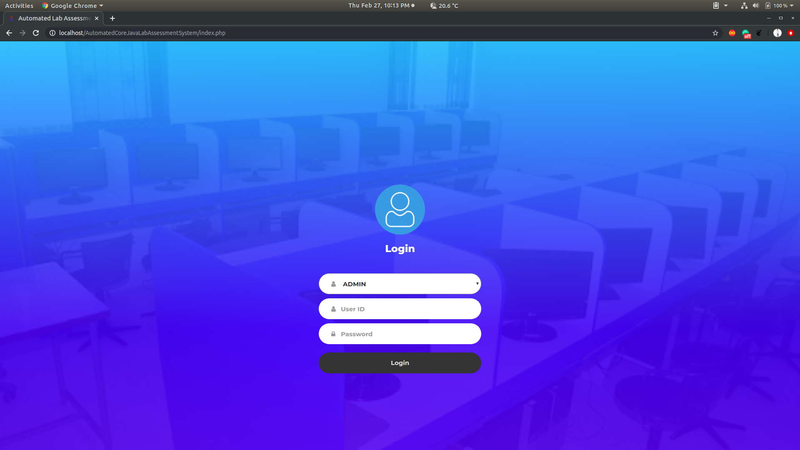
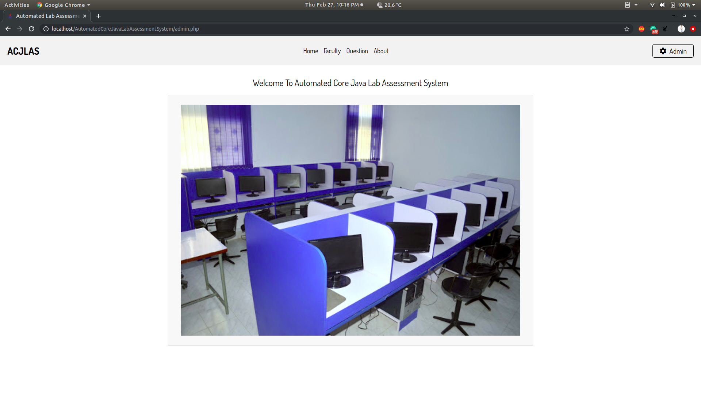
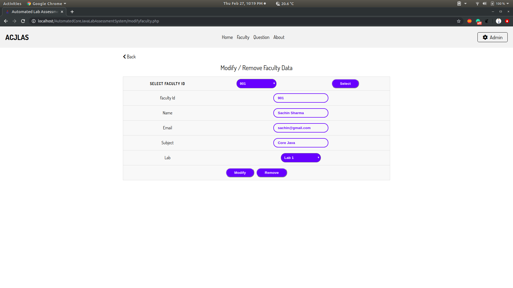
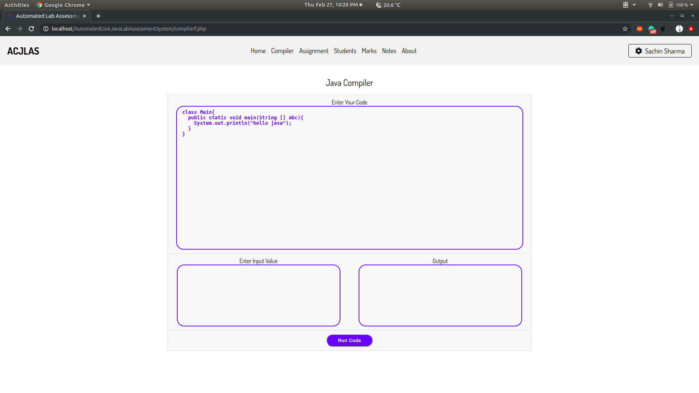
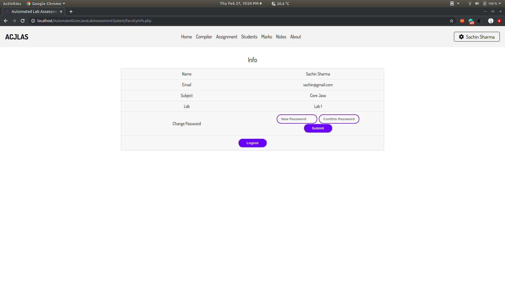

# Automated-Core-Java-Lab-Assessment-System
- This is a web application to manage the Java Lab. By using this application there will be a transparency between student and faculty. 
- Students need to code on that platform that will be checked automatically.
- Marks will be assigned to them automatically.
- Student will get Core java notes.
- Students will learn to implement code in real time.
- Reduce the workload of faculty.
- Students can also easily take the notes on the system.

## Some Screenshot of this Web Application :

- Login Page

- Home Page

- Update Faculty Data

- Compiler Page

- Update Personal Details
